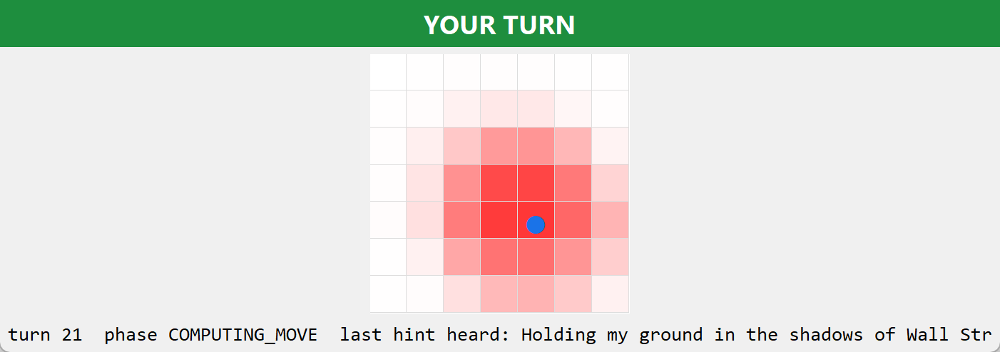
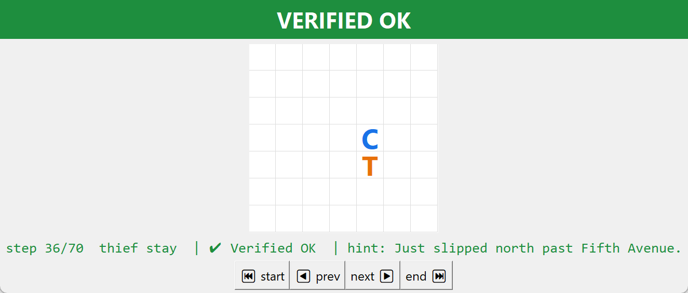

# moamteam — THIEF agent

> **This repository is the THIEF agent** of moamteam's final
> project (rule #49: one repository per agent). The engine is symmetric
> and role-parameterized — run this side with:
>
> ```powershell
> uv sync
> uv run python -m moamteam peer --role thief --gui
> ```
>
> Sibling repository (police agent):
> <https://github.com/J0kErF/moamteam-police>

> **moamteam** · Final project, *Orchestration of AI Agents* (Dr. Yoram Segal,
> University of Haifa, 2026). Binding spec: `police_thief_p2p.pdf` v3.0.0.

Two symmetric autonomous agents — a Cop and a Thief — chase each other on a discrete
grid with **no central server and no judge**. Each agent is simultaneously a FastMCP
server and client; truth is enforced by SHA-256 commit-reveal and honest-claim
protocols; partial observability is softened by decaying pheromone scent fields and
Bayesian belief maps; and the only channel allowed to lie is free natural language.

**Status: feature-complete (210 tests green; ruff + mypy clean in CI).** All seven book stages built and
observed working, league wire dialect compatible with reference-derived peers,
competitive strategy layer tuned and measured. Remaining before submission: counted
league games. Development history: [`docs/PLAN.md`](docs/PLAN.md) ·
[`docs/TODO.md`](docs/TODO.md) · one PRD per stage in [`docs/`](docs/).

## Run

```powershell
uv sync
uv run python -m moamteam demo                                  # single-process sanity match
uv run python -m moamteam peer --role thief                     # terminal 1
uv run python -m moamteam peer --role police --gui              # terminal 2 (+ live GUI)
uv run python -m moamteam series --role thief                   # full num_games league series
uv run python -m moamteam replay --log logs/police_match.json   # cryptographic replay
uv run pytest                                                    # 210 tests
uv run ruff check src tests scripts && uv run mypy               # lint + types (also in CI)
uv run python scripts/strategy_lab.py                            # strategy win-rate table
```

Quality gates run on every push (`.github/workflows/ci.yml`): ruff, mypy and the
full pytest suite. Modules stay small by decree (~150 lines): the peer's protocol
lives in `peer/phases/` (handshake → turns → audit) around a slim `PeerRuntime`.

---

# Academic Report

## 1. The Dec-POMDP model

We model the pursuit as a **Decentralized Partially Observable Markov Decision
Process** ⟨n, S, {Aᵢ}, P, R, {Ωᵢ}, O, γ⟩ (book ch.1):

| Element | Instantiation |
|---|---|
| n | 2 symmetric agents (police, thief) |
| S | positions² × barrier sets × decaying scent fields × turn counter — exponential in board side, defeating brute force (the design intent of the 7×7 floor) |
| Aᵢ | {N,S,E,W,STAY} ∪ police-only {BARRIER(cell ≤1 away)} ∪ verbal hints (may lie) |
| P | deterministic physics from the signed `config/game.json` — both peers enforce the identical contract, no referee needed |
| R | the fixed scoring table: capture 20/5, survival 5/10, tie 2, technical 0/0 |
| Ωᵢ | own position, public barrier declarations, the rival's decaying scent snapshot, and its ≤15-word natural-language hint |
| O | deterministic scent physics ⊕ an adversarial linguistic channel — the observation function itself is strategic |
| γ | implicit in the strategy layer's patience (barrier traps pay off many turns later) |

The key asymmetry the model surfaces: **scent cannot lie** (emitted by physics,
unfakeable, half-life ≈6.6 turns under τ←(1−ρ)τ, ρ=0.10) while **words can** — so
each peer runs a Bayesian belief grid combining a motion-diffusion prior, a scent
likelihood, and a hint boost with *adaptive reliability*: a hint whose claimed
half-board holds <20% of the observed scent mass is flagged as a lie and the
speaker's credibility is halved (observed live: reliability 0.6 → 0.3 after one
caught lie).

## 2. FastMCP orchestration dilemmas

Each peer is a FastMCP **server** (tools: `negotiate`, `receive_turn`,
`submit_audit`, `receive_control` — thread-safe inbox queues) and a **client** of
the rival's URL, behind a single-gateway **Orchestrator** and a strict phase machine
(`WAITING → COMPUTING → COMMITTING → AWAITING_REVEAL → VERIFYING`, `TECHNICAL_LOSS`
terminal). Dilemmas we hit and how we resolved them:

* **The turn token.** No referee hands out turns; the token travels *with* the turn
  message. A strict transition table converts any protocol confusion into a loud
  error instead of a silent deadlock (rule #5).
* **Peers start minutes apart.** A naive handshake gave up after ~25s of
  connection-refused. The handshake now retries up to `connect_timeout_seconds`
  with watchdog heartbeats inside every backoff.
* **Tunnel rate limits.** One MCP session per call ≈ 4-5 TLS round-trips; ngrok's
  free tier started refusing mid-game. The client holds **one persistent session
  per match**, transparently rebuilt on failure, plus configurable turn pacing.
* **Long thinks vs. the watchdog.** A legitimate 3-minute opponent think must not
  look like a frozen loop: waits are sliced into 1s polls with heartbeats between.
* **A missed deadline is a failure, not patience** (rule #6): bounded retries, then
  a clean technical-loss turn close — observed against a dead tunnel endpoint.

## 3. Trust without a judge

Every turn is sealed: `commit = SHA256(canonical_json(payload) | nonce)` — byte-
compatible with the reference simulator, so cross-team audits verify both ways. The
payload holds step, role, state string, position, move, truth/lie intent and hint;
only the hash crosses the wire, nonces stay secret until the end-of-game audit
(rule #18). **No move or position ever travels in the clear**: capture is
adjudicated by honest claims (police `capture_claim` on landing, confidence-gated;
thief's truthful `claim_response`, rules #21/#22; barrier-on-my-cell #46; jail
self-declaration #47) and survival by the thief's `win_claim`. Step-0 seals the
machine spec, code version and the exact git commit played (rule #53).

The **Replay Viewer** re-verifies a finished match four ways: reveal-vs-commit,
commit-vs-wire (defeats re-sealing), physics + sealed-position consistency against
the reconstructed world, and claim honesty + outcome coherence. A cheating peer
that rewrites one hint before the audit is caught over the real wire and the match
voided (end-to-end test).

### League interop adaptations (negotiated 2026-08-11)

Real cross-team play surfaced two dialect gaps in an opposing implementation:
its series runtime opens with `receive_turn` directly (never calls `negotiate`),
and its client treats a single refused connection as fatal. Two **opt-in**
adaptations ship for this — defaults remain strict-mutual: (1)
`[network].handshake_mode = "send_only"` still pushes our sealed step-0/identity
to the opponent's `negotiate` inbox for both audit trails, but does not await a
reply; byte-identity of the shared config is then agreed out-of-band by SHA-256
before the series and recorded in the artifacts. (2)
`scripts/connection_holding_proxy.py` keeps the public port continuously
accepting across our per-sub-game process restarts (the backend is retried for a
bounded window instead of refusing). The strict path stays the default and the
only mode used between our own peers.

## 4. Strategies implemented

Full analysis: [`docs/STRATEGY.md`](docs/STRATEGY.md). The driving finding: a greedy
Manhattan chaser **never** catches a distance-maximizing evader (0% capture, all
seeds — distance parity). Our brains therefore optimize **local escape area** (a
depth-limited BFS of the cells the rival can still reach):

* **FunnelPoliceBrain** — one-ply search over steps *and* barrier placements scored
  by the thief's remaining local world under a pessimistic reply; quota economy
  (walls cost more while the world is open) and belief-confidence gating (no walls
  on a <12% guess). Corner drives and two-wall jails *emerge* from the search.
* **SafeThiefBrain** — distance + local-area evasion with hard danger overrides at
  range ≤2. Two instructive failure modes were found and fixed on the way:
  global area is gradient-free (the cop never bought the first wall), and raw local
  area over-rewards centrality (the thief center-hugged into a walking capture).

| matchup (20 seeds, perfect information) | capture % | avg turns | avg walls |
|---|---|---|---|
| greedy cop vs either thief | 0% | 35.0 | — |
| Q-learning cop (5,000 episodes) vs classic evader | 0% | 35.0 | — |
| **funnel cop vs classic evader** | **100%** | 13.0 | 2.0 |
| funnel cop vs our safe thief | 40% | 28.6 | 1.6 |

**Reinforcement learning:** implemented and evaluated, not fielded. A tabular
Q-learning police brain (`strategy/qlearn.py`, trained offline by
`scripts/train_qlearn.py` with distance-shaped reward) scores **0% capture vs the
classic evader after 5,000 episodes — identical to the greedy chaser it
functionally rediscovers** (table above). The measurement confirms the design
theorem: no pure pursuit policy, learned or engineered, catches a
distance-maximizing evader; capture requires the funnel's escape-area search and
barrier economy. The Q-brain remains config-selectable for experiments; movement
stays 100% deterministic Python either way (the LLM only writes hints).

## 5. Screenshots (mandatory content, book ch.7)

**Live GUI — the police's Bayesian belief heatmap (local truth only).** Deeper red =
higher probability for the hidden thief; blue dot = own position; dark cells =
declared barriers:



**Replay Viewer — cryptographic witness, green Verified OK banner:**



## 6. Sibling repository

This project ships as two separate repositories (book ch.9): the **police** agent
and the **thief** agent. Cross-links:

* Police agent: <https://github.com/J0kErF/moamteam-police>
* Thief agent: <https://github.com/J0kErF/moamteam-thief>

## 7. League interop (conformance kit adoption)

We adopted the community **[copthief-league-protocol](https://github.com/Imreec/copthief-league-protocol)
interop kit** (teams imreeyal & anrbj666) as a conformance harness — vectors and a
practice opponent only; all strategy, belief and decision code remains ours. The kit
pins the byte-level constructions the book leaves to inter-team agreement (its own
academic-freedom clause, p.v), and it operates strictly inside the book's
"open-to-agreement" space: no binding minimum is lowered anywhere.

What we verified and aligned (all documented interpretations, per the clause):

* **CORE vectors reproduced byte-for-byte** — canonical JSON (`ensure_ascii=False`),
  the reference commit construction `SHA256(canonical(payload)|nonce)`, the terms
  signature, `game_uid`/`game_id` (sorted pair, flat-terms derivation), and the
  report consensus signature (spaced serialization, sign-then-insert, trimmed 5-key
  scope). Vendored fixtures: `tests/fixtures/interop_kit_vectors/`, enforced by
  `tests/test_interop_kit_conformance.py`.
* **Turn order** — thief moves first (the reference implementation's own behaviour,
  implied by wire `reference-v3`); override per pairing via `[network] first_mover`.
* **Series tie rule** — `series_add`: the App. F tie score is added to each side's
  summed total (league-wide convention, adjudicated by course staff).
* **At-least-once receiver contract** — inbound turns dedup on `commit`, bounded
  reorder buffer, stale-step discard, equivocation stays loud (`turns.delivery_decision`).
* **Pairing declarations** — `role`, `sub_game_number` and the derived `game_uid`
  ride the negotiate extras top-level; refusal only when both declare and disagree.
* **Sealed `move`** — reference spelling (`MOVE:S` / `BARRIER:-` / `HOLD:-`) with our
  structured form beside it as `move_detail`, so reference-shaped verifiers can parse
  our records (§3 says schema is free; we are conservative in what we send).
* **Artifacts** — the four files carry `game_uid`; the log carries the revealed
  `records` chain + `summary`; the series-level `result_<game_id>.json` follows the
  played league schema and passes the kit's `check_artifacts.py`, including the
  cross-team join (`mutual_agreement.sha256` byte-identical against the kit's
  sparring peer; both role directions audited "Verified OK" both ways over MCP).

Scent model: we deliberately implement the book's ch.4 model (≈`multiplicative_book_v1`,
see PRD-04); the scent field is transmitted, never re-derived cross-team, so this is
declaration-relevant only — we declare no scent lock (omission never refuses).

Privacy note: our declaration artifact carries member IDs for the lecturer's email
only — repos publish artifacts *without* the gitignored `members.local.toml` overlay.

---

## Repository layout

```
config/game.json        shared, signed game contract (Appendix-F binding defaults)
config/police|thief/    private per-peer TOML (never shared, never signed)
docs/                   PLAN, TODO, STRATEGY, PRD-01…07, screenshots
scripts/                gmail_auth, strategy_lab, capture_screenshots, split_repos
src/moamteam/           domain · shared · peer · infra · crypto · strategy · report · gui
tests/                  197-test pytest suite
```

Secrets (`credentials.json`, `token.json`, `.env`, `*.local.toml`) are **never**
committed — enforced by `.gitignore` from the first commit; OAuth material lives
outside the repo tree entirely.
